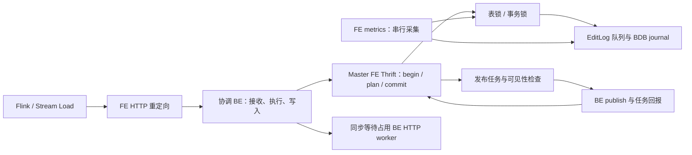

<!--
Copyright (c) 2026
厦门市美亚柏科信息安全研究所有限公司
Xiamen Meiya Pico Information Security Research Institute Co., Ltd.
SPDX-License-Identifier: LicenseRef-MassDB-Commercial
Use is governed by LICENSE-MASSDB.txt and a separate agreement with the company.
Upstream and third-party components retain their respective licenses.
-->

# 600 节点、200 万逻辑 tablet：FE 周级卡顿与入库阻塞排查

审计日期：2026-09-21。代码：当前工作区，HEAD `59329855b4e`；上游基线见
`MODIFICATIONS.md`（Doris `4.0.5-rc01`）。本报告针对存算一体。
用户确认故障集群使用当前代码、重启 FE 后恢复；尚未提供 FE 业务日志或线程栈。
2026-09-22 补充故障当天 Master 的 GC 日志片段，详见
[GC 实证分析](/data/project/massdb-sql/docs/fe-gc-log-analysis-20260922.md)。
用户补充 FE 元数据位于 SSD；日志是否共盘及故障期 I/O 延迟尚未知。
数量按最初描述的 **200 万逻辑 tablet，不包含副本** 理解。
现场后续确认：FE 服务器 512G 内存、96 核 CPU；OpenJDK 17.0.2，ZGC。
2026-09-22 用户提供并确认以附件为准，实际配置基线修正为 `-Xms125g -Xmx300g`，
未设置 `SoftMaxHeapSize`；此前口述的 180g/360g 不再作为生产基线。
完整配置分析见 [附件专项审计](/data/project/massdb-sql/docs/fe-config-audit-20260922.md)。
JVM 的 `g` 按 GiB 计算；主机实际可用物理内存仍以 `/proc/meminfo` 为准。副本数、FE 数量和
重启时是否发生 Master 切换尚未知。下文三副本计算只是条件示例。

这是源码审计、局部验证和现场操作手册，尚未连接故障集群；不能把代码风险等同于已定位现场根因。
本次不更改 FE/BE 运行逻辑。已有审计文档的历史结果与本次验证分开说明。

## 1. 结论与检查顺序

**最新实证更新：** 9 月 20 日约 108 分钟的 GC 片段中，142 轮 GC 最大 Pause 3.306ms，
没有新增已记录的 Allocation Stall；Live 约 30～37GiB，GC 后 Used 约 49～92.5GiB，
有效 Java 线程采样约 1.25 万。下调本窗口“GC 长暂停、存活堆撑满和 Thrift 十万上限触顶”假设，
优先查线程/锁/journal 的业务进展与较高分配量的来源。该片段不覆盖全部两周，
也未覆盖所有 safepoint、native 内存和未结束等待；下表仍保留条件性机制。

最应优先检查的不是 Flink 的 Broken pipe，而是 **Master FE 的连接/线程资源、journal 进展、
堆存活量和业务锁等待链**。Broken pipe 只表示客户端写入已关闭的连接，不能说明谁先出问题，
也不能证明该批数据未提交。

**结合已确认的 300 GiB 大堆与 96 核：下调“普通初始容量太小”的假设，继续优先检查连接/线程资源和
journal/业务锁。** 大堆不能排除长期对象增长、ZGC 分配阻塞或 checkpoint 被内存阈值跳过；
必须用真实 heap used、GC 周期/分配等待和 image 进展区分。该配置的专项判断见第 4.4 节。

| 优先顺序 | 候选机制 | 与现象的关联 | 最快确认/排除方法 |
|---|---|---|---|
| 1 | 空闲 Thrift 长连接占用 worker；附件上限 10 万，先核查线程/FD/native 资源，拒绝缺口仅在拒绝发生时适用 | 600 BE、逐渐增长、重启断开连接后恢复；查询端口可正常 | 9020 连接数、Thrift 线程数、进程限额、连续栈中是否大量空闲 socket read |
| 2 | BDB/journal 慢写或卡住，持业务锁等待 edit log | 入库/DDL 停顿，读查询仍可执行；监控也可被同锁拖住 | `EditLog-Flusher`、时间戳线程、journal monitor 所有者及磁盘/quorum |
| 3 | 堆存活量/临时队列/线程原生内存增长，GC 或 checkpoint 压力 | 周级恶化、重启暂时恢复；长暂停期间多个接口共同失联 | GC 后存活量、暂停总时长、RSS/堆差、线程/FD 趋势、image 水位 |
| 4 | tablet report、统计扫描、健康检查长持锁 | 大元数据规模放大等待，积压使负载继续增加 | 连续栈、报告与扫描每轮耗时、对应表锁/倒排索引锁 |
| 5 | 发布线程按库串行，热点库队列阻塞全局调度 | COMMITTED 增多、可见性等待长、入库限流 | 事务状态和最老年龄、`PUBLISH_VERSION`/`PUBLISH_VERSION_EXEC-*` 栈 |
| 6 | 事务历史清理吞吐不足或 Short 队列饿死 Long | 历史对象、image、清理锁时间渐增 | 按库 finished 趋势、清理实耗时、事务创建/完成速率 |
| 7 | `/metrics` 串行并同步读业务状态，HTTP 池被等待占用 | 监控断线可以和 Stream Load 重定向卡住同源 | 第一个进入 `MetricRepo.getMetric` 的线程在等什么 |
| 8 | BE HTTP worker 同步等待数据执行或 FE RPC | FE 故障可传播到 BE 的 Stream Load 和 metrics | 分清断线的是 FE 还是 BE；检查协调 BE 的 HTTP 栈 |

“重启恢复”提高了连接、暂态队列、进程内缓存/锁和 GC 的嫌疑，但不排除重启触发的 Master 迁移、
暂时降载及 BE 重试状态变化。事务历史和元数据会从 image/journal 恢复，并不会因重启自动清零。



## 2. 第一优先：Thrift 连接与线程容量失配

**附件修正：** `thrift_server_max_worker_threads=100000`；`THREADED` 这个未知模式名回退到
`THREAD_POOL`。下文 4096 是源码默认值的机制分析，不能再作为生产触顶证据。
当前优先判断绝对线程数、FD、native 内存和 OS/cgroup 限额；10000 worker 在此上限下仅显示 10% 使用率。
用户进一步确认：去年最初 4096 不够用，之后逐步调大。该历史不等于本次周级故障已证明线程触顶。
应保留当前 100000 的容量设置，
先区分正常连接、空闲保留和请求内部阻塞；不把上限本身当作配置错误，也不直接下调。

### 2.1 当前源码的具体机制

- [Config.java:485](/data/project/massdb-sql/fe/fe-common/src/main/java/org/apache/doris/common/Config.java:485)：
  `thrift_client_timeout_ms=0`。名称容易误导：本路径把它用于 **FE 接受的服务端 socket 读超时**，
  不是 BE 的一次 RPC 超时。
- [Config.java:614](/data/project/massdb-sql/fe/fe-common/src/main/java/org/apache/doris/common/Config.java:614)：
  `thrift_server_max_worker_threads=4096`；第 1447 行默认 `THREAD_POOL`。
- [ThriftServer.java:143](/data/project/massdb-sql/fe/fe-core/src/main/java/org/apache/doris/common/ThriftServer.java:143)：
  使用 `TThreadPoolServer`，第 241 行设置 socket timeout。其 worker 处理同一连接上的请求循环，
  空闲连接阻塞在 read 时仍占一个 worker，并非每次请求结束就释放线程。
- [exec_env_init.cpp:245](/data/project/massdb-sql/be/src/runtime/exec_env_init.cpp:245)：通用 FE client cache。
  [utils.cpp:60](/data/project/massdb-sql/be/src/agent/utils.cpp:60)：进程级 `MasterServerClient` 另有独立 cache。
  [config.cpp:780](/data/project/massdb-sql/be/src/common/config.cpp:780)：二者默认每 host 分别保留 10 个空闲连接。
- [client_cache.cpp:96](/data/project/massdb-sql/be/src/runtime/client_cache.cpp:96)：无可复用连接时可新建；
  第 222 行只在归还时限制空闲 cache 大小，没有空闲 TTL。

因此，如果 600 个节点是 BE，两套缓存对于同一 Master 的 **潜在空闲保留容量** 是
`600 × (10 + 10) = 12000`。这不是实际连接数，也不是总连接硬上限；通用 cache 也可能访问其他 FE。
如果采用默认上限，平均每 BE 向 Master 保留约 7 条连接就已超过 4096，还没计 FE→FE 和正在执行的请求。
附件实际上限为 100000，12000 的潜在缓存容量并不能证明触顶，应转向线程/FD/native 的实际预算。
不同 BE 的历史并发峰值逐渐抬高缓存占用，能够解释“启动正常、运行多日后恶化”。

### 2.2 更严重的拒绝处理缺口

[ThreadPoolManager.java:119](/data/project/massdb-sql/fe/fe-core/src/main/java/org/apache/doris/common/ThreadPoolManager.java:119)
使用 `SynchronousQueue + LogDiscardPolicy`；第 363 行的拒绝 handler 只记录日志和计数，然后正常返回。
当前依赖 libthrift 0.16.0 的 `TThreadPoolServer` 依赖捕获 `RejectedExecutionException` 来关闭
刚接受但无法处理的连接。吞掉异常会绕过这条清理路径：TCP 连接已经建立，却没有 worker 服务。
这还可能增加暂时悬空的 socket/FD；不能把它描述成每个 FD 都必然永久泄漏。

观察线程池大量 active worker 时（默认配置可能接近 4096，附件不是这个上限），必须区分：

1. 大量栈停在 `TThreadPoolServer$WorkerProcess → TBinaryProtocol → TSocket.read/socketRead`：
   更支持空闲/半包连接占位。
2. 大量栈停在事务锁、BDB、发布、规划：更支持业务处理被下游拖住。
3. 两者同时存在：先解除阻塞源，再解决空闲连接的容量问题。

确认应结合 9020 连接数和多个时点的相同栈。Java `RUNNABLE` 可以是 socket 原生 read，不能只看状态认定 CPU 忙。
现有 `thread_pool` 指标的 `name="thrift-server-pool"`、`type="pool_size/active_thread_num/task_rejected"`
有帮助；`task_in_queue=0` **不能**证明健康，因为这里是 `SynchronousQueue`。

### 2.3 解决方案

- 确认空闲连接占位后，先计算整个集群的连接预算，分开预算缓存空闲连接和活跃 RPC。
  减少 BE 的两个 cache 保留量属于可验证方向；配置在构造时捕获，当前不能假设在线修改能立即缩小已有缓存。
  不给所有场景强制一个固定值：过低会造成连接重建风暴。
- FE 设置合理非零 socket read timeout 能让真正空闲的 worker 退出；当前 `accept()` 会读取配置，
  已接受 socket 不会因此自动改值。该配置未标 mutable，按受控重启/发布验证。
  超时过小也会断开大 report 传输或慢连接，必须验证断连重连、commit 结果不确定时的重试语义。
- 代码修复：为 Thrift 服务使用会抛拒绝异常的 handler，让上层显式关闭拒绝连接；增加拒绝/关闭计数。
  给 BE cache 增加空闲淘汰和可观测性；必要时区分通用与 Master RPC 的预算。
- 当前 100000 上限有现场较小容量触顶的背景，先保留。实际线程增长需要相应 native/FD 预算；
  扩容能缓解接入拒绝，但仍需用吞吐、延迟和等待链判断阻塞是否已经消除。
- 不直接切到 `THREADED_SELECTOR`：须验证 framing/transport、现有 C++ client 协议和 handler 行为，
  不能把它当作不需改客户端的安全开关。

## 3. journal/BDB 与业务锁：入库卡、查询仍可用

现场已确认元数据在 SSD，降低基础介质性能不足的嫌疑。仍须区分本地持久化延迟、
复制确认等待和进程内锁阻塞；SSD 不消除后两者。附件未覆盖的 BDB 默认持久化策略为
Master/Replica 均 SYNC、确认策略 SIMPLE_MAJORITY；有多个投票 FE 时需满足复制确认条件，
不要求所有 FE 确认。实际拓扑和故障期延迟仍待核对，不能仅凭 SSD 类型认定或排除 journal 阻塞。

[EditLog.java:147](/data/project/massdb-sql/fe/fe-core/src/main/java/org/apache/doris/persist/EditLog.java:147)
是无界 `LinkedBlockingQueue`；第 1518 行 producer 入队后无期限等待完成。
默认 `enable_batch_editlog=true`。调用方可能持有事务/表锁，因此队列后面的请求不只是排队，
还会阻塞依赖这些业务锁的请求。

[BDBJEJournal.java:230](/data/project/massdb-sql/fe/fe-core/src/main/java/org/apache/doris/journal/bdbje/BDBJEJournal.java:230)
是同步方法；第 270 行给 `OP_TIMESTAMP` 接近无限的重试次数，第 305 行在持 monitor 时睡 5 秒再重试。
时间戳走直接写路径。若 quorum、复制网络或 BDB 磁盘出问题，可出现：

`时间戳持 journal monitor → EditLog-Flusher 等 monitor → producer 等 journal 完成并持业务锁 → 入库/监控等待`。

这是一条具体阻塞链，并不需要发生 JVM 死锁或 CPU 打满。查询可以读取旧的已提交数据，或在其他 FE 执行。
如果直接连接同一个 Master 的新查询也正常，则更支持“特定 RPC/写路径受阻”；
如果只是原有查询继续跑，不能据此推断 FE 新请求也正常。

**诊断盲区：**
[BDBJEJournal.java:211](/data/project/massdb-sql/fe/fe-core/src/main/java/org/apache/doris/journal/bdbje/BDBJEJournal.java:211)
判断 `watch.getTime()>100000`，单位毫秒，实际为 **100 秒**，注释却写 `100ms`。
几秒或几十秒慢写可能没有这条 slow warning。现有 `journal.write.latency.ms` 和
`editlog.write.latency.ms` 主要在完成后更新，永远没完成的那次写入也未必显示为高延迟样本。

**现场确认：** 三份线程栈追到最终持锁者；同时查元数据盘 await/队列深度/剩余空间、BDB 的
`InsufficientReplicas/InsufficientAcks/DatabaseException`、9010 网络、FE 成员存活和 replay 进展。
一台 follower 故障不必然失去多数派，须按实际投票拓扑判断。

**解决：** 恢复元数据盘和多数派复制的实际瓶颈；增加 journal 队列深度、最老等待时间、当前写入时长、
成功/失败速率；修正慢日志阈值并限频。不能为已入队的持久化写简单加 timeout 后当作失败返回，
因为该操作稍后可能提交；有界队列/背压也应在修改业务状态前设计，保留一致性。
不通过关闭复制确认、降低持久化要求、删除 BDB 文件来换取表面恢复。

## 4. 内存、GC、checkpoint 和长期增长

### 4.1 静态规模本身只是基线

若 200 万逻辑 tablet、3 副本，则每个持全量目录的 FE 管理约 600 万 replica；
600 BE 平均约 1 万 replica/BE，但峰值分布可能很不均匀。
副本对象同时挂在多个索引结构中：不能简单把引用次数当成对象复制次数，也不能不测量就给出固定 GB 容量。
`conf/fe.conf` 的模板堆为 8 GiB，与现场附件确认的 `Xms125g/Xmx300g` 不同，不能用模板解释现场故障。

区分四类趋势：

| 观测 | 优先解释 | 下一步 |
|---|---|---|
| 完成主要 GC 后的存活量持续上升 | 元数据合法增长、历史对象保留、强引用泄漏 | 对齐 tablet/分区/事务/profile 数与堆对象增长 |
| 存活量稳定但分配速率/GC 占比升高 | 全量 report/统计扫描、峰值队列、checkpoint | 看分配热点、后台任务耗时与触发时刻 |
| Java heap 稳定但 RSS/线程数增长 | 线程栈、直接内存、JNI/Arrow、mmap或ZGC映射口径 | `/proc`、PSS、实际物理压力与已有NMT交叉核对，不能直接把RSS−heap当原生泄漏 |
| CPU 不高、GC 正常但大量线程长等同一锁 | journal、业务锁或线程池饱和 | 优先跟锁所有者，不盲调 GC |

### 4.2 checkpoint 可以放大，并把内存问题变成磁盘问题

[Checkpoint.java:141](/data/project/massdb-sql/fe/fe-core/src/main/java/org/apache/doris/master/Checkpoint.java:141)
在同 JVM 加载 checkpoint Env、replay、save，随后再加载 image 验证。
即使代码先释放引用，也不能假设 GC 已立即收回空间。默认内存阈值 70%，超阈值可以跳过 checkpoint。
第 250 行以后：所有非 Master FE 推送成功才进入 journal 清理；删除水位还受落后 FE 的 replay 水位限制。

可能的循环：内存余量不足 → checkpoint 持续失败 → image 落后、journal 保留增加 → 磁盘/BDB 压力增加 →
写请求和队列更慢 → GC/锁等待更重。仅凭 image 很旧不能确定是内存，也可能是推送或 replay 失败。

观察 image 编号/更新时间、最大 journal、最小 replay、BDB 大小和磁盘空余的趋势；
不能把大集群的 BDB 一刀切按某个固定 GB 数判为故障。
解决应恢复峰值内存余量、image 分发和 FE 复制；正式移除已确认退役的成员，不能手工删除元数据。
`force_do_metadata_checkpoint=true` 或简单提高阈值可能导致 OOM，不是默认处理方法。

### 4.3 有条件的生命周期问题

此前的 [FE 内存审计](/data/project/massdb-sql/docs/fe-memory-gc-audit-20260907.md) 已列出 22 项对象生命周期风险。
本场景只按实际启用功能筛选，不把所有项目都算成根因：

| 使用条件 | 重点对象/路径 | 判断与处理 |
|---|---|---|
| 大量普通 Stream Load/INSERT/2PC | `TransactionState`、label map、两条 finished deque | 先检查第 6 节清理吞吐与年龄 |
| FE coordinator 多实例导入、自动建分区且频繁超时中止 | 自动分区事务缓存 | 检查库级超时中止是否走完整清理；普通 BE 发起 Stream Load/单实例当前跳过该缓存 |
| 启用详细执行 profile 且异常/取消很多 | `ExecutionProfile`、coordinator、context | 查未完成标记与注销链路；不能说默认所有 profile 都无限增长 |
| 高频建删表且使用 Group Commit/动态分区 | 历史表统计 map、动态分区 runtime 信息 | 对比存活表数与历史键数，修 drop 清理 |
| Flight SQL/Arrow/长期 prepared statement | Arrow native buffer、statement/context | 查 RSS 与 heap 差、关闭和异常路径；普通 Flink Stream Load 不等于使用 Flight |
| 外部 catalog、JDBC 驱动频繁变化 | classloader、cache/gauge、外部元数据 ID 树 | 检查历史 owner 是否仍被注册表引用 |
| Ranger/Hive、DFS、长期外部会话 | audit events、filesystem、会话历史 | 与实际插件/调用量对应后再排查 |

统计缓存、SQL cache、审计队列、回收站、schema change/job 历史也占内存；“有上限”不等于上限适合现场，
“存活时间长”也不自动等于泄漏。优先从增长最大的真实对象树出发。
不要用一次强制 Full GC 后恢复来证明 GC 参数就是根因；换 ZGC 也不会修复强引用保留或容量不足。

### 4.4 已确认配置：512G / 96 核 / OpenJDK 17.0.2 / ZGC 125–300 GiB

**CPU 和物理内存大，不会自动扩大软件并发或解除串行锁。**
附件已把 Thrift 上限改为 100000、report worker 改为 16、tablet report 分片池核心改为 64，
但发布按 DB 映射单线程和 journal 写入串行不会因为机器有 96 核自动改变。
单个关键线程打满一核，在按整机归一化的 CPU 图上只占约 1/96；
socket read 或锁等待可能几乎不消耗 CPU。
另有线程池按 `availableProcessors()` 定大小，例如 `TabletStatMgr` 默认值为 -1，
如果 JVM 实际看到 96 个 CPU，它可以并发发起约96路统计请求；cgroup和显式参数可能改变这个数。
因此不是所有后台任务都只用少数核，也不能按总CPU利用率决定盲增线程。

**checkpoint 默认阈值在堆未满时就能触发。**
[GcNames.java:34](/data/project/massdb-sql/fe/fe-core/src/main/java/org/apache/doris/monitor/jvm/GcNames.java:34)
不识别 JDK 17 ZGC 的 `ZHeap`，但
[Checkpoint.java:387](/data/project/massdb-sql/fe/fe-core/src/main/java/org/apache/doris/master/Checkpoint.java:387)
已有全堆回退，计算的是 `heapUsed * 100 / heapMax`，**不是 used/committed，也不是除以 Xms**。
默认 `metadata_checkpoint_memory_threshold=70`，百分比先整数截断，`<=70` 放行。
若 `heapMax` 实际为300GiB且未强制checkpoint，第一次因默认阈值拒绝大约在
`used >= 0.71 × 300 = 213 GiB`；不是一超过210GiB就立刻拒绝。

例如某次采样的 used 为260GiB，尚有约100GiB到Xmx，checkpoint仍可能因为上述保护跳过。
这是解释路径示例，并非现场已观测值。若持续跳过，还可能经journal保留转化为BDB磁盘/写入问题。
应检查实际阈值、`get jvm memory used percent`、`Save image failed`、image序号和最小replay水位。
ZGC瞬时used包含尚未回收的垃圾，不能把它直接当作GC后的存活集。
默认 `checkpoint_manual_gc_threshold=0`，当前代码先递增后比较，因此默认不会主动调用 `System.gc()`；
不能把故障未经取证就归为定时强制GC。

**ZGC 的观测口径要调整。**
[SimpleCoreMetricVisitor.java:79](/data/project/massdb-sql/fe/fe-core/src/main/java/org/apache/doris/metric/SimpleCoreMetricVisitor.java:79)
只输出识别出的young/old百分比，ZGC下缺失；普通
[PrometheusMetricVisitor.java:75](/data/project/massdb-sql/fe/fe-core/src/main/java/org/apache/doris/metric/PrometheusMetricVisitor.java:75)
仍输出 `jvm_heap_size_bytes{type="used|max|committed"}`，并输出原始GC名字。
young/old曲线缺项从启动就存在，无法单独解释一两周后整次scrape间歇超时。
现场应分别观察：

- 完整GC周期后的堆占用低位趋势、瞬时used与committed；不要只盯old曲线。
- `ZGC Cycles`、`ZGC Pauses` 分开统计；Cycle很长不等于所有线程停顿同样长。
  [NereidsPlanner.java:796](/data/project/massdb-sql/fe/fe-core/src/main/java/org/apache/doris/nereids/NereidsPlanner.java:796)
  把所有GC MXBean耗时相加，profile中的该值不能直接解释为查询STW暂停。
- GC日志中的 `Allocation Stall`、分配速率、周期频率；低STW暂停仍可能伴随分配等待。
  同时看进程实际可用CPU、系统memory/IO pressure、swap、cgroup限额和OOM事件。
- JDK17非分代ZGC使用多重映射，VSZ不是物理占用，RSS也可能受映射口径影响。
  结合 `smaps_rollup` 中的PSS、系统可用内存、cgroup实际内存与已有NMT；不能机械把RSS除以3。
  现有脚本未采PSS/cgroup，必要时现场另行有限时读取，不能靠其RSS值单独判定原生泄漏。
  多重映射与统计偏差的背景见 [Dev.java ZGC架构说明](https://dev.java/learn/jvm/tool/garbage-collection/zgc-deepdive/)。

**Xms125g、Xmx300g 的解释与调参条件。** 未设置SoftMaxHeapSize时，当前17.0.2的默认软上限
跟随Xmx，不能把Xms125g解释成SoftMax125g或堆只能使用125g。
若没有另行禁用，ZGC默认允许归还长时间空闲的堆内存，默认延迟300秒，不会缩到Xms以下。
所以该配置允许125–300GiB之间扩缩容；commit/uncommit、缺页和内存供给延迟值得与故障时刻对齐。
这些行为参见
[JDK17 GC调优指南第9章](https://docs.oracle.com/en/java/javase/17/gctuning/hotspot-virtual-machine-garbage-collection-tuning-guide.pdf)。

不能只因Xms小于Xmx就认定配置错误。若观测到扩缩容相关延迟，且实际物理余量允许，
可在同负载预演中比较等大Xms/Xmx或关闭uncommit；一次只改变一个条件。
将Xms提高到300g会改变最低提交内存预算；预触页还会改变启动时间和物理驻留，不能不测量直接上线。
按512GiB粗算的212GiB差额需要容纳OS、page cache、Metaspace、线程栈、GC元数据、直接内存和其他进程，
并不是已经确认的可用余量。ZGC需要堆内分配/回收余量，物理机还有空闲不代表300GiB堆里有足够空间。

**JDK补丁版本单独验证。** 17.0.2为2022年的早期17更新版本，见
[17.0.2发布说明](https://www.oracle.com/java/technologies/javase/17-0-2-relnotes.html)。建议把同一JDK17主版本内的
受维护补丁构建列入离线回归和对照测试。先保持125/300g及业务负载一致，比较GC、checkpoint、
连接与事务进展；再单独测试堆伸缩策略。当前没有证据将现场故障绑定到某个JDK已知bug，
不承诺更新JDK解决应用层连接、锁或强引用问题；仓库启动脚本要求JDK17，也不直接跳到其他主版本。

本轮在本机OpenJDK17.0.2以32/64MiB小堆读取最终flags，确认未设置时SoftMaxHeapSize=Xmx、
ZUncommit=true、ZUncommitDelay=300。仅验证参数默认行为，未申请生产大小堆、未进行生产性能实验。

**调整后的现场顺序：** 先记录9020连接与Thrift等待栈、journal/flusher锁链；
同时看ZGC allocation stall、heap used与image进展；随后定位report/发布/清理的最老等待。
若used长期明显低于checkpoint阈值、无allocation stall且GC周期稳定，应降低内存/GC假设的优先级，
集中检查连接和串行阻塞。

## 5. 大 tablet 数下的全量扫描与锁放大

[TabletInvertedIndex.java:158](/data/project/massdb-sql/fe/fe-core/src/main/java/org/apache/doris/catalog/TabletInvertedIndex.java:158)
持全局 `StampedLock` 读锁，复制 BE 的 replica entries、向共享池提交分片，并在第 247 行 `allOf().join()`。
排队和等待时间都在读锁范围内。增删 tablet/replica 需要同一锁的写锁。
第 543 行还会查事务状态，因此事务锁/journal 慢可能传导到 report 的持锁时长。

这能形成锁等待放大，但静态代码不足以断言发生了环形死锁。
`StampedLock` 也不能仅凭 jstack 没有“Found deadlock”就排除长等待。

**当前已有保护不能误报：** `ReportHandler` 已按 BE/type 合并待处理上报，默认多 worker；
分片池已经是 `CallerRunsPolicy`，不是会悄悄丢掉 future 的 `DiscardOldestPolicy`。
队列条目数受合并约束不代表内存字节小：每个最新全量 report 仍可持有大量 `TTablet/TTabletInfo`。
报告线程按 BE 分片，一个慢 report 也会拖住该分片后面的 BE。

[TabletStatMgr.java:81](/data/project/massdb-sql/fe/fe-core/src/main/java/org/apache/doris/catalog/TabletStatMgr.java:81)
每个 FE 拉取所有活 BE 统计；第 160 行以后在表读锁内扫描 tablet/replica。
默认周期 60 秒。三副本示例中，每个 FE 一轮处理百万级对象；增加 FE 数不会分摊这条全量任务。
[TabletChecker.java:308](/data/project/massdb-sql/fe/fe-core/src/main/java/org/apache/doris/clone/TabletChecker.java:308)
也持表读锁扫描；默认间隔 20 秒。任务耗时加 sleep 才是实际轮次周期，不能机械推算始终每 20 秒扫完。

现场查 `finished to do tablet diff ... cost`、`finished to check tablets ... cost`、
`finished to update index row num ... cost` 的趋势，以及被卡线程的锁链。
记录队列最老任务年龄比只看队列长度更有价值。

方案：控制继续增长的小 tablet/分桶数量、避免同时大规模 DDL/repair/rebalance 与入库峰值；
代码上分片局部归并结果、分批短持锁、增量统计、按预算处理。
不能直接把 readUnlock 提前，因为 worker 正在使用和修改共享 replica 状态，必须补快照/版本一致性协议。
不要盲增 report worker：更多并行可能加重分配、结果容器锁和全局读锁占用。

`tablet_stat_update_interval_second` 虽标 mutable，但当前构造时捕获周期，未见每轮刷新；
`tablet_checker_interval_ms` 明确不可动态修改，注释要求生产不要修改。
因此本报告不把在线调大这些参数当作已经验证有效的处理方案。

## 6. 事务清理与发布：两个不同的队列问题

### 6.1 历史清理预算不公平且有吞吐上限

[DatabaseTransactionMgr.java:1962](/data/project/massdb-sql/fe/fe-core/src/main/java/org/apache/doris/transaction/DatabaseTransactionMgr.java:1962)：
每库每轮最多删 10000 个，Short 先消耗预算，Long 只得余量；全过程持事务写锁并写 edit log。
[GlobalTransactionMgr.java:589](/data/project/massdb-sql/fe/fe-core/src/main/java/org/apache/doris/transaction/GlobalTransactionMgr.java:589)
串行遍历各库。默认每轮后 sleep 30 秒。因此每库最大清理能力约为：

`10000 / (30 秒 + 所有库本轮清理耗时)`。

理想上限约 333 个/秒/库，真实值更低；不是全局 333/s。
默认 `label_num_threshold=2000` 是每条 finished 队列触发按数量清理的阈值，**不是强硬容量上限**。
不能忽略它而直接用“12 小时 × 事务速率”预测历史数量；也不能因为有它就断言历史不会积压。
若每轮 Short 可删项持续占满 10000，Long 可以持续得不到清理预算。

源码默认 Short TTL 12 小时、Long TTL 3 天；附件已改为 1 小时和 30 分钟。
缩短 TTL 不提高最大删除吞吐，而且应按 Flink 故障恢复、
checkpoint 和 label 去重所需时间核对实际保留窗口。重启会恢复历史事务，不能把重启后的暂时好转直接归功于“历史被清空”。
实际 label 保留同时受 TTL 和数量阈值影响；数量清理可以早于 12 小时，单独延长 TTL 不能保证恢复去重窗口。

解决：减少小事务数、合理增大批量；为 Short/Long 分配公平预算，分段持锁和持久化；
增加按库清理数量、耗时、最老年龄和剩余量指标。在 journal 卡住时先解决 journal。

### 6.2 发布按库串行，队列满会拖住全局调度

[PublishVersionDaemon.java:248](/data/project/massdb-sql/fe/fe-core/src/main/java/org/apache/doris/transaction/PublishVersionDaemon.java:248)
按 DB hash 到单线程发布队列；默认线程池组和队列各 128。
[ThreadPoolManager.java:403](/data/project/massdb-sql/fe/fe-core/src/main/java/org/apache/doris/common/ThreadPoolManager.java:403)
队列满后 `offer` 最多等待 60 秒。全局触发线程可能因为一个热点库或 hash 冲突的库阻塞，
使其他库的发布调度也推迟。不能认为“配置 128 个线程”意味着同一个 DB 有 128 路吞吐。

现场重点看 COMMITTED 最老年龄、发布队列、表写锁、错误副本与任务回报；
慢 BE 的 publish、MOW delete bitmap/锁、版本顺序等待都可能是下游原因。
普通 Stream Load 可以等 visible；**当前 2PC 第二阶段走 commitTransaction2PC，仅 commit，不执行普通 Stream Load 的 visible wait**。
Flink PRECOMMITTED 长时间未被第二阶段提交，还要检查 checkpoint 完成/恢复链路。
源码 PREPARE 的默认流式导入超时为 3 天，但附件已改默认值及最大允许值为 600 秒；
PRECOMMITTED 仍默认为 3600 秒，具体任务可有不同预算。
COMMITTED 不走普通事务超时 abort，不能靠提高/等待 load timeout 消除发布积压。

解决：减少过度并发小事务、处理慢/异常副本、协调 schema change/repair；
代码避免全局调度线程在单队列长时间等待，保留必要的库内/分区版本顺序并加入公平性和背压。
直接把所有队列加大只是延后显性失败，可能把问题变成更高内存和更长等待。

## 7. 为什么监控断线，以及 HTTP 配置陷阱

[MetricRepo.java:1312](/data/project/massdb-sql/fe/fe-core/src/main/java/org/apache/doris/metric/MetricRepo.java:1312)
的整个 `getMetric()` 是 `static synchronized`。
采集期间同步扫描 load jobs、读取事务状态计数和部分元数据。
事务 gauge 在第 403 行进入事务管理器，后者拿事务读锁；journal 最大 ID 等指标也进入相应组件。
一个慢业务锁可以拖住第一条 scrape，再使其余 scrape 等类锁。
`publish_txn_num` 还会持事务读锁筛选、排序已提交事务；部分其他 gauge 直接读取缓存，
这里的 tablet 数 gauge 也不是每次扫描全部 tablet，不能把所有指标都视为全量扫描。
`/metrics?type=core` 仍调用同一个方法，**不是独立的无锁逃生接口**。

FE metrics 与 Stream Load redirect 同属 HTTP 服务；越来越多请求等待时会消耗 HTTP worker。
MySQL 查询使用不同入口，因此“监控断而查询正常”完全可能。
如果断的是 BE metrics，则要看第 8 节，不能把所有 exporter 缺口都归到 FE GC。
若直连 metrics 正常而 Prometheus `up=0`，优先检查抓取 timeout、LB、路由、认证和监控自身。

此外，[HttpServer.java:160](/data/project/massdb-sql/fe/fe-core/src/main/java/org/apache/doris/httpv2/HttpServer.java:160)
仍设置旧的 `server.jetty.threadPool.maxThreads/minThreads`、`server.jetty.acceptors/selectors`。
当前依赖 Spring Boot 3.5.7 使用 `server.jetty.threads.max/min/acceptors/selectors`。
本地真实 Binder 验证显示：旧键设置 400/20/2/4 后仍是属性默认 200/8/-1/-1，正确键才绑定成功。
这证明旧键不生效，不等于已经测得现场 Jetty 最终线程数；外部属性或自定义配置仍可能覆盖。
只调 `jetty_threadPool_maxThreads` 可能没有预期作用，需修映射并检查启动后的实际池参数。

解决：将指标改为后台更新、HTTP 读取有时效标记的快照；限制重叠采集，避免持全局锁访问业务锁。
单独的 liveness/OS/JVM 采集不能依赖同一条业务锁链。
故障时停止人工高频重试 `/metrics`；客户端超时不保证取消服务端正在等待的采集。

## 8. BE、Flink 与传输层的次级问题

### 8.1 BE 的同步 HTTP 等待会放大 FE 故障

[stream_load.cpp:180](/data/project/massdb-sql/be/src/http/action/stream_load.cpp:180)
在 handler 内 `ctx->future.get()`，随后同步 precommit/commit RPC。
[ev_http_server.cpp:62](/data/project/massdb-sql/be/src/http/ev_http_server.cpp:62)
直接从 HTTP event callback 执行 handler。默认 `webserver_num_workers=128`。
大量加载同时等待时可占住协调 BE 的 HTTP worker，使该 BE 的 metrics/新请求也延迟。
该 `get()` 自身没有 deadline，不意味着整个 load 完全没有其他超时/取消机制。
上传阶段也有同步等待：`on_chunk_data → body_sink.append → StreamLoadPipe::_append` 在缓冲满时等待消费，
同样占用 HTTP worker，可能表现为客户端写入停住。见
[stream_load_pipe.cpp:200](/data/project/massdb-sql/be/src/io/fs/stream_load_pipe.cpp:200)。

如果所有卡住任务集中于少数协调 BE，应同时检查 BE 内存限流、memtable flush、磁盘满/慢、
load channel、brpc、tablet version/rowset 数、compaction 债务、MOW delete bitmap 和异常副本。
重启 FE 可以让上游排队/连接重建，却不会真正消除 BE 磁盘和 compaction 的持续能力不足。
控制负载、合理批量、处理热点与存储瓶颈；不要仅增加 HTTP worker。

### 8.2 可复用连接沿用旧 RPC 超时：当前代码的确定缺口

[client_cache.cpp:96](/data/project/massdb-sql/be/src/runtime/client_cache.cpp:96)
命中 cache 时不应用本次 `timeout_ms`，只在第 187 行新建或 reopen 时设置 send/recv timeout。
普通 begin 默认 60000ms，而 precommit/commit 通常传 `txn_commit_rpc_timeout_ms=180000`。
同一通用 frontend cache 复用时，commit 可能沿用 begin 的 60 秒；反方向也可能沿用更长超时。
请求体携带的服务端预算与 socket 实际超时由此不一致，导致客户端先超时、FE 仍执行，重试再加负载。

这能解释超时行为不稳定，是放大因素，单独不足以解释周级增长。
修复应在每次 checkout 时设置本次 RPC 的 send/recv timeout，测试 begin→commit、commit→begin、
cache miss、reopen 和异常重试；不要只改配置数值而保留复用缺口。

### 8.3 可见版本通知覆盖：确定缺陷，但影响要说准

[PublishVersionDaemon.java:272](/data/project/massdb-sql/fe/fe-core/src/main/java/org/apache/doris/transaction/PublishVersionDaemon.java:272)
每事务重置实例累计 map，并行时又绕过累计锁；会丢失其他事务待发送的 BE 可见版本通知。
详见 [BUG-005](/data/project/massdb-sql/docs/bug-audit-20260907.md:229) 的历史真实类探针。

FE 事务 VISIBLE/分区 visible version 已独立更新，丢的是 BE 用于 compaction 等用途的通知；
tablet report 可以补发，BE compaction 也有数量/时间兜底。
应修成每事务局部 map，再在锁内累计；不能声称该缺陷必然导致事务永远不可见、永久数据丢失或所有合并停止。
它与 report 已经很慢时叠加，可能增加版本/rowset 保留压力。

### 8.4 Flink 与网络应检查，但按证据降级/升级

检查 connector 版本、sink 并发、checkpoint 周期/耗时/失败重试、2PC 是否启用、label 前缀唯一性、
客户端 connect/socket timeout、服务端 load timeout、LB idle/body timeout、307 重定向后 BE 是否可达。
追同一个 label/txn 的完整阶段，不能把各处不同任务的报错拼成同一条因果链。

多次重试必须保留可核对的 label/txn 语义。收到 Broken pipe、Publish Timeout 或完全没收到响应时，
先查询状态；不知道结果时随意换新 label 重放，可能造成重复写入。
不要为了绕过现象直接关闭 exactly-once/2PC，也不要无条件放大所有 timeout。

## 9. 其他必须覆盖的条件分支

以下是故障树覆盖项，尚无现场证据时不是“已发现的代码 bug”。

| 分支 | 现场信号 | 对应处理 |
|---|---|---|
| OS CPU 配额、虚拟化 steal、NUMA/调度 | process CPU、run queue、cgroup throttled、CPU pressure | 核对实际资源隔离和同机竞争 |
| swap、native 内存、线程数/FD 上限 | swap-in/out、memory pressure、RSS/heap 差、limits、FD/thread 增长 | 修资源泄漏/连接预算，留 JVM 外空间 |
| 日志盘或元数据盘空间/inode/IOPS | filesystem 空余、inode、IO await、日志轮转/压缩时刻 | 隔离 IO、修保留策略；禁止删活动 BDB |
| DDL/自动分区/动态分区/schema change/恢复并发 | 表写锁、锁持有者、同一时刻任务 | 避峰、分批、修长锁，不随意取消持久化阶段 |
| BE 心跳抖动引发调度/clone 风暴 | 活跃节点上下线、unhealthy tablet、repair/clone 队列 | 先修网络/磁盘真实故障，避免反复扩散调度 |
| TCP 重传、NAT/防火墙 idle、LB reset | 直连与LB差异、TCP reset/retrans、代理日志 | 对齐网络超时与连接复用；再验证重试 |
| DNS/反向解析/离线域名不可达 | 名字解析线程栈、解析延迟、FE/BE地址变动 | 本地 DNS/hosts 一致性与有效超时 |
| Kerberos/LDAP/Ranger/外部鉴权 | 仅相关用户/表卡、renew/鉴权栈、7天等周期 | 查票据续期、本地服务可达、审计队列；未启用则排除 |
| binlog、回收站、job/缓存配置异常 | 对应对象/历史规模持续增长 | 先确认启用与真实保留窗口，再调整 |
| 系统时钟跳变/FE 时间差 | chrony状态、BDB clock delta、日志时间跃迁 | 修内网授时，排除超时/选举异常 |
| 锁反转/丢唤醒/后台线程异常退出 | 多份栈完全无进展、关键daemon消失/反复异常 | 追完整持锁链和最后一次进展；不能只重启掩盖 |
| 监控系统本身过载或配置错误 | FE/BE直连正常、Prometheus scrape失败 | 分离 exporter、网络与存储侧监控故障 |

## 10. 不带出日志的离线现场操作

### 10.1 在健康期和故障期各取一次，先取证再重启

在每台 FE 本机，用 FE 进程同一用户运行；PID 要人工确认，端口使用实际值。
脚本不联网外发、不读取进程环境变量/完整命令行、不做 GC/heap dump、不改数据库。
输出保留现场，目录必须尚不存在。

```bash
bash /path/to/tools/fe-stall-collect.sh --pid 12345 --output /var/tmp/fe-stall-baseline --rpc-port 9020
bash /path/to/tools/fe-stall-collect.sh --pid 12345 --output /var/tmp/fe-stall-fault --rpc-port 9020 --jvm
```

`--jvm` 才会用 jcmd 做三次 `Thread.print -l`，中间间隔 5 秒；attach/线程快照可能有短暂停顿，
并非零开销。每次客户端有限时，超时不保证取消已经进入 JVM 的诊断操作。
如需一次本机 HTTP 观测可加 `--http-port 8030`，请求只发 loopback `/metrics`、不跟重定向。
默认不发该请求，避免 metrics 已堵时继续添加等待者；认证/HTTPS 环境应由现场工具单独处理。

脚本完整原始结果不必带出。现场人员先填写第 10.5 节判定表。
脚本不能自动断言根因，也不代替 GC 日志、磁盘采样、BDB 状态和业务事务关联。

### 10.2 必须在现场对齐的采样

- 每 FE：角色、进程 uptime、启动时间、实际 JVM/FE 配置；重启前后 Master 是否变化。
- 每 FE：线程总数、Thrift socket-read 线程数、9020 ESTABLISHED/其他状态、FD 数、RSS、heap、GC 后存活量。
- 操作系统：有工具时 `vmstat 1 10`、`iostat -xz 1 10`、`pidstat -p PID -t 1 10`；
  没工具用脚本 `/proc` 与 pressure 快照。平均CPU低不能排除某一核或锁瓶颈。
- 本地 GC 日志：对齐故障分钟的 Pause/Full/Concurrent cycle、分配失败/evacuation、暂停占比；
  区分 STW 暂停和并发阶段耗时，不把整个并发GC用时当停顿。
- 元数据：只读查看最新 image 文件名/时间，BDB 占用、磁盘/inode、复制 replay 水位。
  大目录 `du` 也有开销，健康期低频采样，不每秒递归扫。
- Flink/协调 BE：至少保留一个 label/txn 和错误发生时间、连接目标、307 目标、任务 checkpoint ID。

不要在生产高压时反复 `jmap -histo:live`、`jcmd GC.run`、全堆 dump 或高频全量 SHOW TABLETS。
需要第二阶段对象调查时再受控做 heap histogram/dump/JFR；`-all` histogram 不代表无 safepoint 开销。
已有 NMT 可用时看趋势，未启动 NMT 不能靠命令补出过去的 native 分配记录。

### 10.3 只读 SQL：先状态、再单事务

用现场现有认证方式登录 **Master FE 的 MySQL 端口**，不把密码放到 shell 参数。
SQL 也可能等待业务锁；设置客户端时间限制，失败即保留该事实，不高频重试。

```sql
SHOW FRONTENDS;
SHOW BACKENDS;
SHOW PROC '/transactions';
-- 从上一个结果选择一个异常业务库的 db_id，替换 123。
SHOW PROC '/transactions/123';
SHOW PROC '/transactions/123/running';
-- 用真实业务库、事务 ID 替换占位符：
SHOW TRANSACTION FROM your_db WHERE ID = 456;
```

`/transactions/<dbid>` 返回 running/finished 计数；其 running 是当前实现的运行计数口径，
不要未核实就当作所有未最终完成状态的精确分类。运行明细最多显示 2000 项，不能用返回行数估计总量。
只选几个异常库观察，不在故障时反复导出所有 finished 明细。
`SHOW LOAD` 不能替代对普通 Stream Load 事务状态的追踪。

| 所处状态 | 首要追踪 |
|---|---|
| 还没有 txn/没有拿到 FE 重定向 | FE HTTP/鉴权、LB、BE选择、到BE可达性、begin RPC |
| PREPARE 停留长 | body上传/BE执行/flush、FE plan、连接断开、取消是否完成 |
| PRECOMMITTED 停留长 | Flink checkpoint完成通知、2PC第二阶段、重试/恢复、precommit超时 |
| COMMITTED 停留长 | publish任务/回报、版本顺序、慢副本、表锁、FE发布队列 |
| VISIBLE 但客户端没收到成功 | 响应连接/LB、客户端超时、提交后返回路径 |
| ABORTED | 以 Reason/ErrMsg 查主动失败原因，核对是否重试造成放大 |

普通 Stream Load 的 `BeginTxnTimeMs`、`StreamLoadPutTimeMs`、`WriteDataTimeMs`、
`CommitAndPublishTimeMs` 可以定位阶段，但只有响应返回后才拿得到；无响应时要靠同 txn 的栈/日志。

### 10.4 三份线程栈的现场判读

| 同一组持续栈 | 候选结论 | 必须再看 |
|---|---|---|
| 数千 thrift worker 等 socket read | 空闲/半包连接占位 | 连接总量、实际池上限、拒绝计数、每BE连接分布 |
| `EditLog.logEditWithQueue` 等待 + flusher 等 BDB | journal 阻塞 | monitor所有者、BDB复制/磁盘、时间戳线程 |
| report 等 `CompletableFuture.join` + index写锁等待 | report分片长持读锁 | 分片worker究竟在计算、等事务锁还是其他资源 |
| `MetricRepo.getMetric` 类锁排队 | 采集串行放大 | 第一个持类锁线程的下游等待 |
| `PUBLISH_VERSION` 等 `BlockedPolicy/offer` | 发布调度被满队列阻塞 | 对应库的worker与事务最老年龄 |
| `TabletStatMgr/TabletChecker` 长跑 + 表写锁等待 | 扫描或大表锁竞争 | 每轮耗时、CPU分配热点、是否DDL/入库同表 |
| 所有接口一起暂停且对齐长GC/safepoint | JVM/OS暂停 | GC后存活量、swap/cgroup、分配峰值 |
| FE正常、单个BE HTTP大量同步等待 | BE资源或下游FE RPC | 协调BE执行/flush/publish与HTTP worker |

### 10.5 无需导出原始日志的结果表

现场只需给出以下汇总，内部地址/业务名可匿名：

1. 故障与正常时 Master 是否同一台；重启的是 Master、单 follower，还是全部 FE。
2. 各 FE 的线程数 / thrift worker数 / socket-read worker数 / RPC连接数 / FD数。
3. GC 最大暂停和每分钟暂停总量；GC后堆存活量与 RSS 的日趋势。
4. journal 是否继续增长；image/replay 是否进展；BDB盘空余和IO是否异常。
5. 最常见的三个等待栈、最终锁持有者类别；三次采样是否移动。
6. 异常库 running/finished 趋势；一个脱敏 txn 的状态和停留时间。
7. 断线的是 FE metrics、BE metrics、node exporter 中哪些；本机直连是否也失败。
8. 降低入库并发/暂停非必要DDL后是否恢复；恢复时间是秒、分钟还是始终不恢复。

## 11. 处理和修复的落地顺序

**故障当下：** 保留三份栈、连接计数和单事务状态；降低新入库并发和紧密重试，保留数据源重放能力；
按证据处理 Thrift 容量、journal/磁盘或慢 BE。必须重启时先确认 FE 多数派和角色，按现有集群维护流程
逐台处理，记录 Master 是否迁移；不能把所有投票 FE 同时重启当常规办法。

**优先补丁：**

| 顺序 | 变更 | 验收重点 |
|---|---|---|
| A | Thrift拒绝必须显式关闭连接；idle连接预算/回收 | 满池拒绝不留下无人服务socket，恢复后重连正常，实际线程/FD平台化 |
| A | 修正Jetty属性映射；启动时输出实际池参数 | 用当前SpringBoot实际启动验证池值，不只断言Map中存在键 |
| A | BE每次借用client更新本次RPC timeout | 不同timeout交叉复用、断连、reopen、提交结果不确定时重试 |
| A | 修BDB慢日志阈值，增加in-flight/队列年龄 | 写入尚未完成时也能识别停滞，限频不形成日志风暴 |
| B | metrics后台快照并与业务锁解耦 | 事务锁/journal阻塞时仍能返回采样时间与陈旧标志 |
| B | 事务清理公平预算和分段短锁 | Short持续繁忙时Long仍进展，重启replay与label去重一致 |
| B | 发布累计map改局部后合并 | 多事务、第二事务失败、并发合并/发送时无通知覆盖 |
| B | 发布调度避免单队列拖住全局 | 热点库饱和时其他库仍进展，版本顺序正确 |
| C | report/统计扫描短锁、分批、增量 | 高tablet数下P99锁等待/分配下降，无元数据竞态/漏报告 |
| 按证据 | 特定cache/profile/Arrow等生命周期修复 | 对象数量在工作负载停止/结束后回落，异常路径也回落 |

**长期容量与压测：** 采用真实逻辑 tablet、replica、分区、热点库和小事务分布，覆盖所有 BE 的
持久长连接；至少持续超过原来 1–2 周的故障窗口。记录线程/FD、GC后存活量、finished事务、队列最老年龄、
checkpoint成功间隔、元数据盘增长斜率、入库P95/P99和监控抓取成功率。
测试必须包含 checkpoint、故障恢复、FE切换、短时慢磁盘/网络、BE上报峰值；短时高TPS成功不代表长期稳定。

新增 Observer 可以分担查询，但不能消除单 Master 的事务/journal/发布瓶颈，并会增加元数据副本与部分全量统计成本。
减少未来无效小 tablet/过分桶通常比仅加 FE 数更有针对性；已存在分桶的重建/迁移需单独评估业务与容量。

## 12. 证据范围与参考

- 本次逐项核对当前 FE/BE 源码、配置默认值与调用路径；未访问生产环境，未复现600节点的完整故障。
- Thrift依赖使用本地 libthrift 0.16.0 检查并做 loopback 临时端口探针：2 worker、3 条空闲连接，
  使用与当前 handler 等价的拒绝策略；两次实验都确认线程与 socket 清理完成。
  结果如下，只验证连接占位和拒绝处理机制，未模拟完整 FrontendService 业务或600节点故障：

  ```text
  policy=SWALLOW accepted=3 active=2 rejected=1 third_client=READ_TIMEOUT third_server_open=true
  cleanup=complete
  policy=THROW accepted=3 active=2 rejected=1 third_client=EOF third_server_open=false
  cleanup=complete
  ```

  探针为观测状态主动持有 accepted transport 引用，不能用它证明永久 FD 泄漏。
- Spring Boot属性问题使用本地3.5.7真实Binder验证：旧键得到200/8/-1/-1，正确键得到400/20/2/4。
  两个探针源码与输出归档于 `.build-records/fe-stall-audit-20260921.tar.gz`。
- 离线脚本通过 Bash 语法检查、帮助/参数拒绝、普通进程只读采样、防覆盖与输出权限检查，
  还在临时小堆 JVM 上验证了三次真实线程快照，以及一次本机测试 HTTP metrics 请求；目标进程保持存活。
  未对故障集群执行脚本；未运行 FE/BE 全套回归，本次没有数据库运行逻辑修改。
- 发布通知的历史探针和内存对象探针见此前审计，不能充当本次现场观测或已上线修复证据。
- [Apache Doris 4.x 元数据运维说明](https://doris.apache.org/docs/4.x/admin-manual/trouble-shooting/metadata-operation/)
  用于核对 image/journal 与副本维护背景；本报告具体默认值和实现结论以当前源码为准。
- [Apache Doris Flink写入说明](https://doris.apache.org/docs/dev/connection-integration/data-integration/flink-doris-connector/write/)
  用于核对 connector/Stream Load/2PC 的关系。在线 dev 文档可能不同于现场 connector 与本仓库，
  不把其他版本的新行为直接套用到当前版本。

## 13. 单机服务器复现方案

一台独立测试服务器可以验证主要FE故障机制、做真实导入链路测试并比较修复前后行为。
单机不能等价复刻600台物理服务器的跨机网络、独立磁盘和故障域；最终结论应分为
“局部机制复现”“真实FE/BE链路复现”“与生产证据吻合”，不能混为同一等级。
当前仅完成前文记录的局部探针，尚未接入用户拟提供的测试服务器。

### 13.1 分阶段安排进程与资源

1. **快速机制验证**：一个真实FE、少量真实BE、协议客户端/压测器与采集程序。
   先用小堆和受控元数据量，使连接、队列、事务和metrics故障可以独立辨认。
   Thrift接入用大量真实长连接触发，不需要先启动600个BE进程；这验证连接饱和，
   不能据此证明600个真实BE的cache一定自然长到该数量。
2. **复制与journal验证**：需要多数派、复制故障、Master切换时，单机启动3个隔离的FE进程，
   使用小堆、不同端口与独立元数据目录；只对测试成员做可恢复的延迟/断链注入。
   一个FE能测本地journal等待，但不能验证多数派复制行为。宿主机I/O延迟与跨机延迟要分别标注。
3. **生产JVM配置验证**：资源允许时，单个主要FE使用OpenJDK17.0.2、ZGC、125/300g，
   为BE、客户端、原生内存和OS明确留余量；不能在512G机器上同时运行3个300g堆FE。
   其他成员是否启用及其堆预算取决于该轮元数据规模，不能让小堆follower自身OOM污染结论。
4. **长期稳定性验证**：使用后台测试程序持续运行和本地记录，主动交互会话退出后程序仍能保存结果；
   不能依赖聊天会话始终在线采样。先做阈值触发实验，再做覆盖原一两周窗口的持续负载。

所有阶段固定记录构建哈希、JDK、实际flags、FE/BE配置、进程资源限额与运行种子。
单机FE/BE必须设置明确的资源预算，尤其当前BE默认 `mem_limit=90%`，多个进程照搬默认值
可能制造宿主机内存争抢。测试节点的独立目录、端口和限额属于实验环境本身，不能影响其他安装。

### 13.2 优先测试矩阵

| 实验 | 单机具体方法 | 必须观察的结果与边界 |
|---|---|---|
| Thrift长连接/拒绝 | 对真实FE逐级增加持久连接；并发发正常begin/commit/report类RPC | 附件基线为100000上限，重点观测线程/FD/native预算；小上限拒绝实验单独标记，不为追求触顶耗尽宿主机 |
| metrics锁传播 | 持续低并发采集，同时对测试事务/journal制造可撤销的慢路径 | 同一锁链是否同时导致scrape与入库等待；解除慢路径后是否恢复 |
| journal/quorum | 三FE小规模真实复制，单独注入成员链路延迟或测试元数据I/O慢 | flusher、时间戳锁、业务锁与replay水位；必须区分丢一台与丢多数派 |
| 事务清理 | 向热点库产生足够多真实终态事务，混合Short/Long来源 | 清理速率、Long是否持续无预算、finished规模与锁时间；不能只造一张无业务关系的Java map |
| 发布调度 | 真实导入，受控延缓热点库的publish完成，观察其他库 | 全局daemon是否停在offer，其他库是否一起延迟；控制输入速率避免BE先饱和 |
| ZGC/checkpoint | 随真实对象图和导入负载增加，跟踪used、周期、分配等待和image | 验证阈值与checkpoint峰值；只填byte数组只能测堆阈值，不能代表200万tablet的元数据开销 |
| 大规模tablet report | 通过一致的测试目录/协议夹具构造大量tablet、replica与BE身份，分级压测FE report路径 | 单轮处理、全局锁、分配与GC；模拟BE不能用于证明真实存储、clone和compaction能力 |
| Stream Load/Flink2PC | 少量真实BE执行导入；需要Flink专有checkpoint语义时再加实际Flink和匹配connector | label/txn全过程、超时/断连后结果、Exactly-once恢复；HTTP2PC调用不等于完整Flink恢复测试 |
| RPC超时复用 | 在同一cache交替执行不同timeout的真实RPC，并受控延迟响应 | 第一次调用的实际超时是否沿用旧值、reopen后是否变化、是否重复提交 |
| JDK与补丁对照 | 相同负载、种子和配置，单独切换JDK17补丁或一个代码修复 | 故障条件、触发次数、队列年龄和正确性；重启后的短暂恢复不能算修复通过 |

逻辑tablet数从小规模逐级增加，200万是规模验证目标，是否在单机达到需按实测堆、磁盘和构建耗时判断。
真实BE上的200万tablet与仅FE目录中的200万tablet有不同开销；不能拿模拟数据结构的成功替代完整集群测试。
时间可通过更快填充连接cache、增加小事务速率、受控延迟来缩短，但这些加速条件必须记录，
不能宣称“所有一两周后问题都能在几分钟内重现”。

### 13.3 输入与交付

准备信息：测试机CPU架构/核数、内存、可用磁盘和系统版本；可以执行命令的接入方式；
测试专用工作目录；与生产一致的构建和OpenJDK17.0.2。
使用已有可匹配架构的发布包可先跑实验；需要改代码时再准备相应离线构建依赖。
当前仓库的same-host Compose模板固定 `linux/arm64`，不能直接套到x86_64服务器而不换对应包/配置。

若当前工具环境能访问测试机并执行命令，可以部署、运行、取证、实现补丁和重复验证。
若完全隔离且无法直连，则提供离线测试包，由现场执行；原始数据保留现场，仅汇总必要结果。
测试包执行本身可以不依赖模型会话；这不代表模型交互能在隔离机器上自动离线运行。

每个命中的问题交付：可重复步骤、原版失败记录、线程/锁/事务证据、触发参数、最小修复、
同条件回归结果，以及与生产故障是否已经建立联系。没有重现的项目记录覆盖条件和剩余不确定性。
